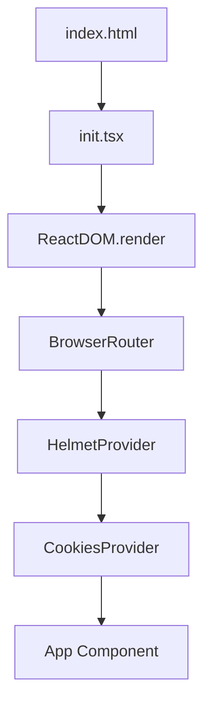
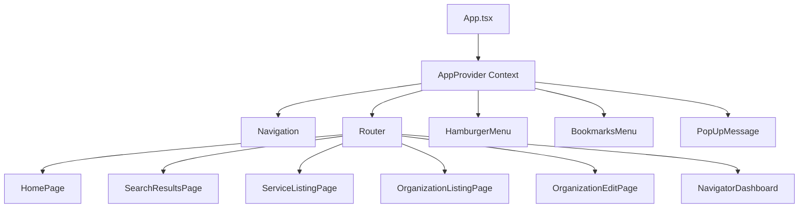
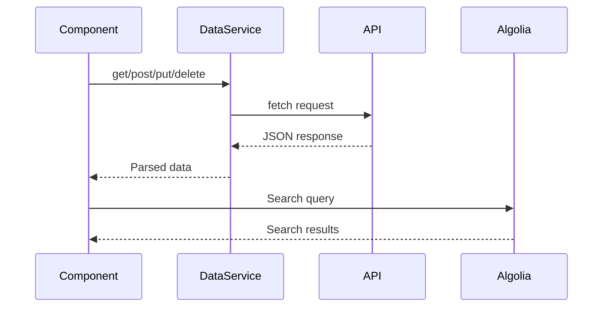
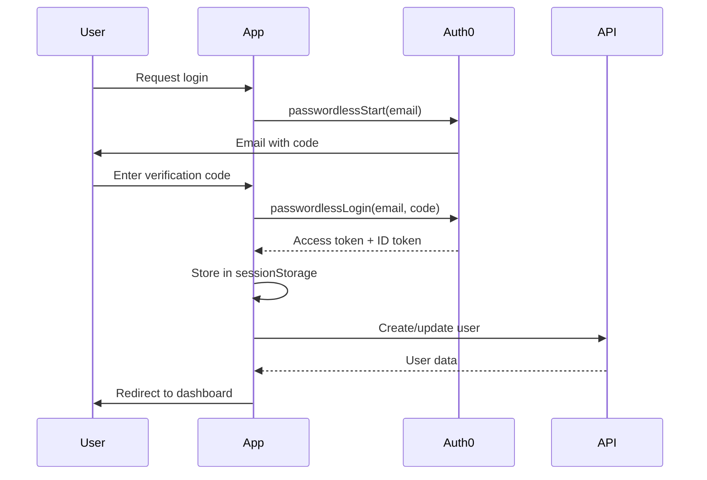

# AskDarcel Web Application - Architecture Documentation

## Overview

**AskDarcel** (also known as **SF Service Guide**) is a web application that serves as an online directory of human services in San Francisco. The application helps users find essential services including food, housing, health resources, legal aid, senior services, and re-entry programs. The system supports multiple white-label variants for different organizations and use cases.

**Repository**: [ShelterTechSF/askdarcel-web](https://github.com/ShelterTechSF/askdarcel-web)  
**License**: GPL-3.0-or-later

## System Purpose

The application's primary goals are:
1. **Service Discovery**: Enable users to search and discover social services in San Francisco
2. **Service Information**: Provide detailed information about organizations, services, locations, schedules, and eligibility requirements
3. **Multi-tenant Support**: Support multiple white-label variants (SF Service Guide, Our 415, Link SF, UCSF Discharge Navigator)
4. **Content Management**: Allow authorized users to create and edit organization/service information
5. **Accessibility**: Provide multilingual support and mobile-responsive design

## Technology Stack

### Core Framework
- **React**: `^16.8.6` (⚠️ Outdated - should be upgraded to React 18+)
- **React DOM**: `^16.8.6`
- **TypeScript**: `^4.7.4` (mixed with JavaScript)
- **React Router DOM**: `^5.1.2`

### Build Tools
- **Webpack**: `^5.73.0` with custom configuration
- **Babel**: `^7.4.4` for transpilation
- **Sass**: `^1.49.7` for styling
- **CSS Modules**: For component-scoped styles

### State Management
- **React Context API**: Primary state management (no Redux)
- **Local Component State**: `useState` hooks and class component state
- **Session Storage**: For authentication persistence

### Authentication & Authorization
- **Auth0**: Passwordless email authentication (`auth0-js@^9.22.1`)
- **Session Management**: Custom session caching via `SessionCacher`

### Search & Data
- **Algolia**: Search engine integration (`algoliasearch@^4.10.5`, `react-instantsearch@^5.0.1`)
- **Custom API Client**: Fetch-based API service layer (`app/utils/DataService.ts`)

### UI Libraries
- **React Modal**: `^3.12.1`
- **React Select**: `^1.0.0-rc.5` (⚠️ Very outdated RC version)
- **React Icons**: `^4.2.0`
- **React Markdown**: `^3.3.2`
- **Google Map React**: `^1.1.4`

### Analytics & Monitoring
- **Sentry**: Error tracking (`@sentry/browser@^4.0.6`)
- **Google Analytics**: Both Universal Analytics (UA) and GA4
- **Intercom**: Customer support integration

### Development Tools
- **ESLint**: Code linting with Airbnb config
- **Prettier**: Code formatting
- **Cypress**: E2E testing (`^12.2.0`)
- **TestCafe**: Additional E2E testing (`^1.18.6`)
- **Mocha**: Unit testing

### Infrastructure
- **Docker**: Development environment
- **Nginx**: Production web server
- **Tiller**: Configuration management (⚠️ Deprecated, Ruby dependency)

## Application Architecture

### Entry Point



**File**: [`app/init.tsx`](app/init.tsx)

**Key Responsibilities**:
- Initialize Sentry error tracking
- Set up React Router
- Configure React Modal
- Render root App component

**⚠️ Issue**: Uses deprecated `ReactDOM.render()` instead of `createRoot()` (React 18+)

### Main Application Structure



**File**: [`app/App.tsx`](app/App.tsx)

**Key Features**:
- Google Analytics initialization
- User location detection
- Global state via Context API
- Navigation and menu components

### Routing Architecture

**File**: [`app/Router.tsx`](app/Router.tsx)

The router uses React Router v5 with a `Switch` component. Key routes:

- `/` - Home page or Navigator Dashboard (if authenticated)
- `/search` - Search results page
- `/services/:id` - Service detail page
- `/organizations/:id` - Organization detail page
- `/organizations/:id/edit` - Organization edit page (protected)
- `/organizations/new` - Create new organization (protected)
- `/auth` - Auth0 callback handler
- `/log-in`, `/sign-up`, `/log-out` - Authentication pages

**Route Protection**:
- `ProtectedRoute`: Requires authentication
- `PublicRoute`: Redirects if already authenticated

### Component Organization

```
app/components/
├── edit/          # Organization/service editing components
├── listing/        # Display components for services/organizations
├── search/         # Search interface components
├── ui/            # Reusable UI components (buttons, modals, etc.)
├── Texting/       # SMS/texting feature components
├── ucsf/          # UCSF-specific components
└── utils/         # Utility components (ProtectedRoute, etc.)
```

### State Management

**Context-Based State**:
- **File**: [`app/utils/useAppContext.tsx`](app/utils/useAppContext.tsx)
- Provides: `authState`, `userLocation`, `setBookmarksMenuOpen`, `authClient`

**Local State**:
- Functional components use `useState` hooks
- Class components use `this.state` (⚠️ Legacy pattern)

**Session Persistence**:
- Authentication state cached in `sessionStorage`
- Managed by `SessionCacher` utility

### Data Flow



**API Service Layer**: [`app/utils/DataService.ts`](app/utils/DataService.ts)

**Key Methods**:
- `get(url, headers?)` - GET requests
- `post(url, body, headers?)` - POST requests
- `put(url, body, headers?)` - PUT requests
- `APIDelete(url, headers?)` - DELETE requests

**API Endpoints**:
- `/api/resources/*` - Organization/resource endpoints
- `/api/services/*` - Service endpoints
- `/api/v2/*` - Go API endpoints (proxied)
- `/api/categories/*` - Category data
- `/api/eligibilities/*` - Eligibility data

### White-Label System

**File**: [`app/utils/whitelabel.ts`](app/utils/whitelabel.ts)

The application supports multiple white-label variants:

1. **SFServiceGuide** (default) - Full-featured service directory
2. **SFFamilies** (Our 415) - Family-focused variant
3. **LinkSF** - Link SF organization variant
4. **Ucsf** (Discharge Navigator) - Clinician-focused tool
5. **defaultWhiteLabel** - Fallback configuration

**Configuration Detection**:
- Based on `window.location.host` and subdomain
- Each variant has different:
  - Logos and branding
  - Feature flags (search, login, etc.)
  - Translation languages
  - Navigation styles

### Authentication Flow



**Files**:
- [`app/utils/AuthService.ts`](app/utils/AuthService.ts) - Auth0 integration
- [`app/pages/Auth/LoginPage.tsx`](app/pages/Auth/LoginPage.tsx) - Login UI
- [`app/pages/AuthInterstitial.tsx`](app/pages/AuthInterstitial.tsx) - Callback handler

**Authentication State**:
```typescript
type AuthState = {
  user: {
    email: string;
    externalId: string; // Auth0 user ID
  };
  accessTokenObject: {
    token: string;
    expiresAt: Date;
  };
} | null;
```

### Search Architecture

**Algolia Integration**:
- Search index managed separately (not in this repo)
- Uses `react-instantsearch` components
- Search results page: [`app/pages/SearchResultsPage/SearchResultsPage.tsx`](app/pages/SearchResultsPage/SearchResultsPage.tsx)

**Search Features**:
- Full-text search across services/organizations
- Category filtering
- Eligibility filtering
- Location-based search
- Map view integration

### Key Pages

#### Navigator Dashboard
**File**: [`app/pages/NavigatorDashboard/NavigatorDashboard.tsx`](app/pages/NavigatorDashboard/NavigatorDashboard.tsx)

- Main landing page for authenticated users
- Category and eligibility filters
- Service discovery interface

#### Organization Edit Page
**File**: [`app/pages/OrganizationEditPage.tsx`](app/pages/OrganizationEditPage.tsx)

- ⚠️ **1961 lines** - Largest component in the codebase
- Class component with complex state management
- Handles organization and service CRUD operations
- Manages addresses, schedules, phones, notes

**Key Functionality**:
- Create/edit organizations
- Create/edit services
- Manage addresses and locations
- Edit schedules and hours
- Handle complex dependency chains (addresses → services)

#### Service Listing Page
**File**: [`app/pages/ServiceListingPage.tsx`](app/pages/ServiceListingPage.tsx)

- Displays detailed service information
- Shows schedules, locations, eligibility
- PDF generation for service handouts

### Build System

**Webpack Configuration**: [`webpack.config.js`](webpack.config.js)

**Key Features**:
- TypeScript/JavaScript compilation via Babel
- CSS Modules with Sass
- Code splitting via contenthash
- Development server with proxy to API
- Environment variable injection

**Build Output**:
- `bundle.[contenthash].js` - Main application bundle
- Static assets (images, fonts) with hashing
- HTML template with injected bundle

**Development Server**:
- Port: 8080
- Proxy configuration for `/api/*` endpoints
- Hot module replacement (via webpack-dev-server)

### Docker Development Environment

**File**: [`docker-compose.yml`](docker-compose.yml)

**Services**:
- `web`: Node.js 18.4 container running webpack-dev-server
- Volume mounts for live code editing
- Separate volume for `node_modules` (performance)

**Configuration**:
- Environment variables from `config.yml`
- Network: `askdarcel` (connects to API service)

### Data Models

**Location**: [`app/models/`](app/models/)

**Key Models**:
- `Organization.ts` - Organization/resource entity
- `Service.ts` - Service entity
- `Schedule.ts` - Operating hours/schedule
- `Address.ts` - Location data
- `User.ts` - User account data
- `Bookmark.ts` - Saved bookmarks
- `SavedSearch.ts` - Saved search queries

### Styling Architecture

**CSS Modules**: Component-scoped styles
- Pattern: `ComponentName.module.scss`
- Global styles: [`app/styles/main.scss`](app/styles/main.scss)

**Style Organization**:
```
app/styles/
├── main.scss           # Global styles
├── components/         # Component styles
├── st-base/           # Base styles
└── utils/             # Utility styles (mixins, helpers)
```

### Testing Strategy

**Unit Tests**:
- Mocha test runner
- Tests in `__tests__` directories
- Example: [`app/components/listing/__tests__/`](app/components/listing/__tests__/)

**E2E Tests**:
- **Cypress**: Modern E2E testing (`cypress/e2e/`)
- **TestCafe**: Legacy E2E tests (`testcafe/*.js`)

**Test Coverage**:
- Limited coverage (many components lack tests)
- Focus on critical paths (listings, search)

### Error Handling

**Global Error Tracking**:
- Sentry integration in [`app/init.tsx`](app/init.tsx)
- Error boundaries (limited implementation)

**API Error Handling**:
- Basic error handling in `DataService.ts`
- Many API calls lack proper error handling (⚠️ Tech debt)

**User-Facing Errors**:
- Generic error messages
- Limited error recovery UX

### Performance Considerations

**Current State**:
- Single bundle (no code splitting by route)
- Large bundle size
- No lazy loading of routes
- Image optimization via webpack loaders

**Opportunities**:
- Route-based code splitting
- Lazy load heavy components
- Optimize Algolia search bundle
- Reduce bundle size

### Security Considerations

**Authentication**:
- Auth0 passwordless email (secure)
- Token expiration handling
- Session storage (not localStorage for tokens)

**API Security**:
- Bearer token authentication
- CORS configuration
- Credentials included in requests

**Content Security**:
- No obvious XSS vulnerabilities observed
- React's built-in XSS protection

## Development Workflow

### Local Setup

1. **Prerequisites**:
   - Docker & Docker Compose
   - Or Node.js 15+ and npm 8+

2. **Configuration**:
   - Copy `config.example.yml` to `config.yml`
   - Set Algolia index prefix (your GitHub username)
   - Configure API URLs

3. **Installation**:
   ```bash
   docker compose run --rm web npm install
   ```

4. **Development**:
   ```bash
   docker compose up
   # Or: npm run dev
   ```

5. **Build**:
   ```bash
   npm run build
   ```

### Code Organization Principles

1. **Feature-Based Components**: Components organized by feature (edit, listing, search)
2. **Shared UI Components**: Reusable components in `components/ui/`
3. **Page Components**: Top-level route components in `pages/`
4. **Utilities**: Shared utilities in `utils/`
5. **Models**: TypeScript interfaces/types in `models/`

### Code Style

- **ESLint**: Airbnb config with TypeScript support
- **Prettier**: Code formatting
- **TypeScript**: Mixed with JavaScript (gradual migration)
- **Component Pattern**: Prefer functional components with hooks

## Known Limitations & Technical Debt

1. **React Version**: Using React 16.8.6 (should upgrade to 18+)
2. **Component Patterns**: Mix of class and functional components
3. **Large Files**: `OrganizationEditPage.tsx` is 1961 lines
4. **API Limitations**: Some API endpoints don't return expected data (documented in code)
5. **Error Handling**: Inconsistent error handling across the codebase
6. **Testing**: Limited test coverage
7. **Dependencies**: Several outdated packages

See [`tech-debt-plan.md`](tech-debt-plan.md) for detailed technical debt items.

## Future Considerations

1. **React 18 Migration**: Upgrade to latest React version
2. **Modern State Management**: Consider Redux Toolkit or Zustand if needed
3. **API Client**: Consider React Query or SWR for data fetching
4. **Component Library**: Standardize on a design system
5. **Performance**: Implement code splitting and lazy loading
6. **Accessibility**: Comprehensive a11y audit and improvements
7. **TypeScript Migration**: Complete migration from JavaScript

## References

- **Main README**: [`README.md`](../README.md)
- **Contributing Guide**: [`CONTRIBUTING.md`](../CONTRIBUTING.md)
- **React Style Guide**: [`docs/react-style-guide.md`](../docs/react-style-guide.md)
- **Data Fetching Docs**: [`docs/data-fetching.md`](../docs/data-fetching.md)
